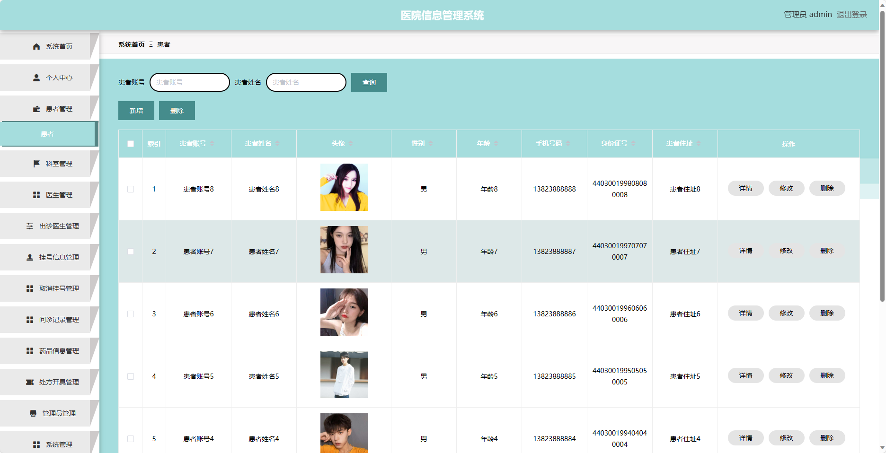
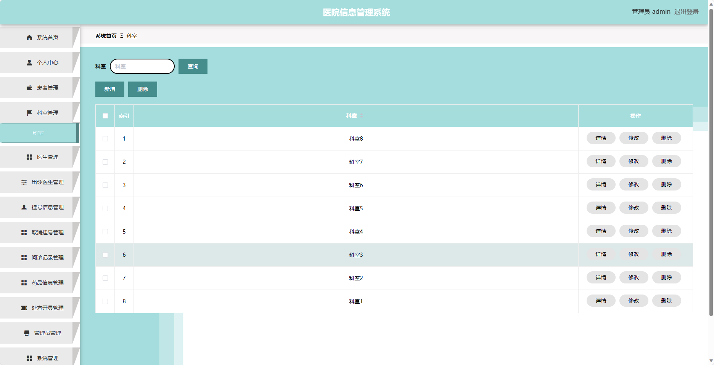
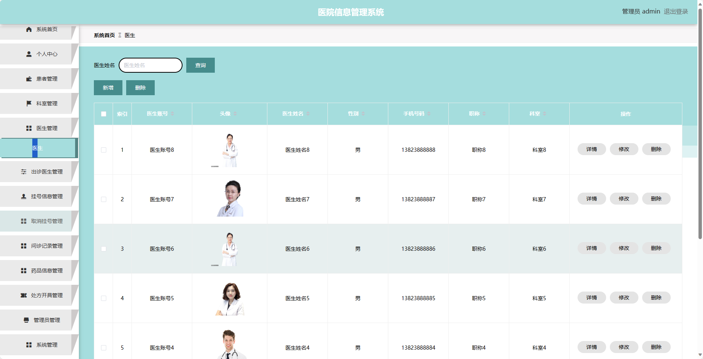
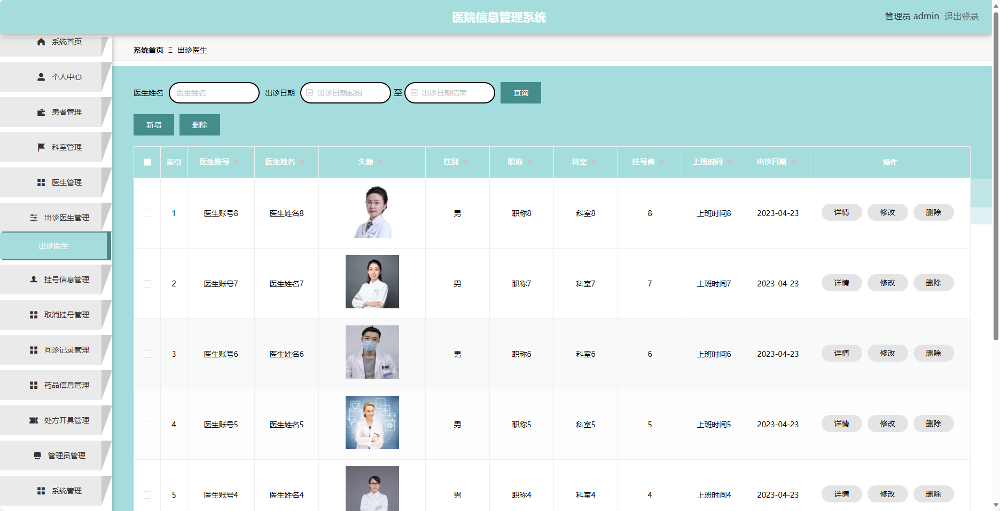
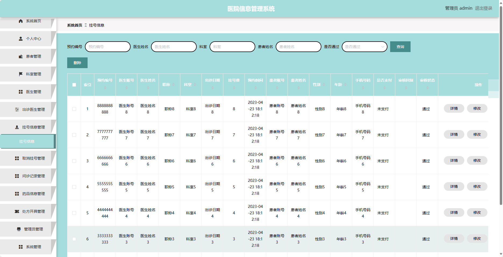
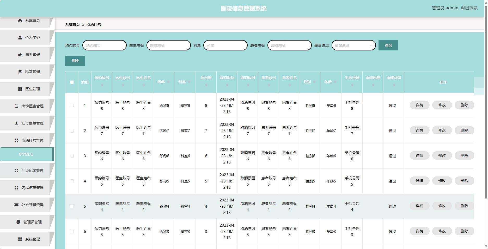
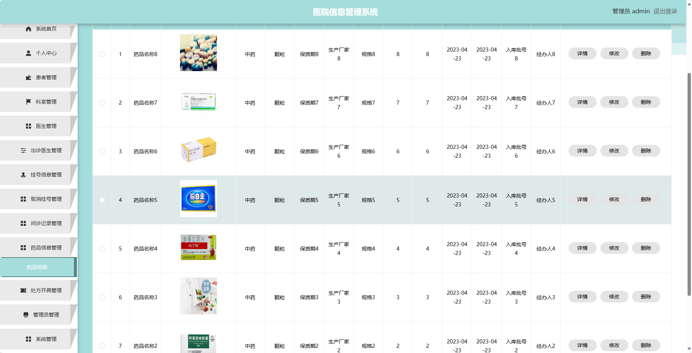

基于SpringBoot的医院信息管理系统
=
- 完整代码获取地址：从戎源码网 ([https://armycodes.com/](https://armycodes.com/))
- 作者微信：19941326836  QQ：952045282 
- 承接计算机毕业设计、Java毕业设计、Python毕业设计、深度学习、机器学习
- 选题+开题报告+任务书+程序定制+安装调试+论文+答辩ppt 一条龙服务
- 所有选题地址https://github.com/nature924/allProject

一、项目介绍
---
基于Spring Boot框架实现的医院信息管理系统，系统包含三种角色：管理员、医生、用户,系统分为前台和后台两大模块，主要功能如下。

### 前台模块：
- 首页：展示医院的基本信息、特色服务等内容。
- 出诊医生：展示医院的出诊医生信息，包括姓名、职称、科室等。
- 医院公告：展示医院发布的公告信息。
- 个人中心：用户可以管理个人信息，修改密码等。

### 后台模块：
### 患者角色：
- 个人中心：患者可以查看和管理个人信息，修改密码等。
- 挂号信息管理：患者可以进行挂号操作，查看自己的挂号信息。
- 取消挂号管理：患者可以取消已经挂号的信息。
- 问诊记录管理：患者可以查看自己的问诊记录。
- 处方开具管理：患者可以查看医生开具的处方信息。

### 医生角色：
- 个人中心：医生可以管理个人信息，修改密码等。
- 出诊医生管理：医生可以管理自己的出诊信息，包括时间、科室等。
- 挂号信息管理：医生可以查看挂号患者的信息。
- 取消挂号管理：医生可以取消患者的挂号信息。
- 问诊记录管理：医生可以管理患者的问诊记录。
- 药品信息管理：医生可以管理药品的信息。
- 处方开具管理：医生可以开具处方给患者。

### 管理员角色：
- 个人中心：管理员可以管理个人信息，修改密码等。
- 患者管理：管理员可以管理患者的信息，包括添加、编辑和删除患者信息。
- 科室管理：管理员可以管理医院的科室信息，包括添加、编辑和删除科室信息。
- 医生管理：管理员可以管理医生的信息，包括添加、编辑和删除医生信息。
- 出诊医生管理：管理员可以管理医生的出诊信息，包括添加、编辑和删除出诊信息。
- 挂号信息管理：管理员可以管理患者的挂号信息，包括查看和取消挂号。
- 取消挂号管理：管理员可以管理患者的取消挂号信息，包括查看和恢复挂号。
- 问诊记录管理：管理员可以管理患者的问诊记录，包括查看和删除问诊记录。
- 药品信息管理：管理员可以管理药品的信息，包括添加、编辑和删除药品信息。
- 处方开具管理：管理员可以管理医生开具的处方信息，包括查看和删除处方信息。
- 管理员管理：管理员可以管理其他管理员的信息，包括添加、编辑和删除管理员信息。
- 系统管理：管理员可以管理系统的相关配置，包括日志管理、权限管理等。

二、项目技术
---
- 编程语言：Java
- 数据库：MySQL
- 项目管理工具：Maven
- 前端技术：VUE、HTML、Jquery、Bootstrap
- 后端技术：Spring、SpringMVC、MyBatis

三、运行环境
---
- 操作系统：Windows、macOS都可以
- JDK版本：JDK1.8以上都可以
- 开发工具：IDEA、Ecplise、Myecplise都可以
- 数据库: MySQL5.7以上都可以
- Tomcat：任意版本都可以
- Maven：任意版本都可以

四、运行截图
---

### 程序截图：

